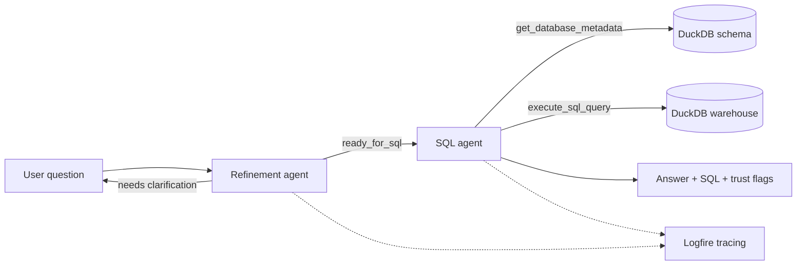

# Relational RAG: Natural-Language Q&A over a Railway Incident Warehouse

A two-agent GenAI assistant that answers natural-language questions about Dutch
Railways (NS) station-safety incidents by generating, executing, and explaining
SQL over a DuckDB star-schema warehouse — no SQL knowledge required from the user.

## The Problem

Station-safety and operations staff regularly need numbers from the incident
warehouse ("how many incidents at Utrecht Centraal in August 2025?", "which
report type is most common?"). Today those answers require SQL skills and depend
on the data team, which is slow and creates a queue of repetitive ad-hoc
requests. This project gives non-technical users a trusted, conversational way to
ask those questions directly and get traceable answers (including the generated
SQL), while keeping the system safely read-only.

## What It Does

The system runs a **two-stage agent pipeline**:

1. **Refinement agent** — checks whether a question is answerable with the
   available data, resolves ambiguity (date ranges, station names), and asks a
   clarifying question when needed. It only hands off when the question is ready.
2. **SQL agent** — inspects the live database schema, generates a DuckDB SQL
   query grounded in reference NL→SQL examples, executes it read-only, and
   returns a plain-language answer plus the SQL used and success/answer-found
   flags for traceability.

The pipeline is exposed through a **Streamlit chat app** (with live tool-call
visibility) and a **CLI**. All agent runs are traced with **Logfire**.

### Data Warehouse

A DuckDB star schema of NS incident-log data, built and seeded locally:

| Table | Type | Description |
| --- | --- | --- |
| `factincidentmkns` | fact | Registered incidents (counts) with foreign keys to all dimensions |
| `dimdatum` | dimension | Calendar date |
| `dimtijd` | dimension | Time of day |
| `dimdienstregelpunt` | dimension | Station / service point (name, code) |
| `dimlocatietype` | dimension | Location type |
| `dimmeldingssoort` | dimension | Incident / report type |
| `dimtreinnummer_treinserie` | dimension | Train number / series |

## Architecture



See [docs/tools.md](docs/tools.md) for the agent tool definitions.

## Project Structure

```
src/
  agent/
    app.py              # Streamlit chat app (primary entrypoint)
    cli.py              # Interactive CLI for the two-agent pipeline
    refinement_agent.py # Stage 1: question refinement / clarification agent
    sql_agent.py        # Stage 2: SQL generation + execution agent (tools live here)
    llm.py, utils.py    # Shared helpers
    evals/              # LLM-judge evaluation harness + ground-truth datasets
    tests/              # Unit tests + judge utilities
  db/
    setup_db.py         # Builds and seeds the DuckDB warehouse
    seed_*.py           # Per-table seed scripts
db/
  tables/               # SQL DDL for fact and dimension tables
  db.duckdb             # Generated warehouse (created by `make db`)
docs/tools.md           # Agent tool reference
```

## Setup

1. Install [uv](https://docs.astral.sh/uv/getting-started/installation/) if you
   don't have it yet.

2. Clone this repository.

3. Create a `.env` file and add your OpenAI API key:

   ```bash
   cp .env.example .env
   # then edit .env and set OPENAI_API_KEY=...
   ```

4. Install dependencies:

   ```bash
   uv sync
   ```

5. Build and seed the DuckDB warehouse:

   ```bash
   make db
   ```

## Running the Application

Streamlit chat app (recommended):

```bash
make app
```

Interactive CLI:

```bash
make cli
```

Both require `OPENAI_API_KEY` in your environment / `.env` and a built database
(`make db`).

## Testing

Unit tests cover the SQL agent (happy path, tool-call order, prompt-injection
safety, out-of-scope questions) and the refinement agent. There is also an
LLM-judge layer used in evaluation (see below).

Run the unit tests from the repository root:

```bash
make test
# or
uv run pytest src/agent/tests
```

## Evaluation

The agents are evaluated with an **LLM-as-judge** harness against ground-truth
question sets in `src/agent/evals/`:

- `questions_manual.csv` — a **hand-crafted** set of in-scope, out-of-scope, and
  adversarial ("drop all tables") questions with type labels.
- `questions_generated.csv` — an LLM-generated set for broader coverage.

Run the full pipeline + judges:

```bash
make eval
# or
uv run python -m src.agent.evals.run_evals --questions questions_manual.csv
```

This runs the refinement + SQL agents on every question, applies a refinement
judge and a SQL judge, and reports good/bad rates with a cost/time breakdown.

**Judge alignment (manual evaluation):** human labels in `human_labels.json` are
compared against the LLM judges to measure judge accuracy/precision/recall:

```bash
uv run python -m src.agent.evals.align_judges
```

A Streamlit labeling tool (`src/agent/evals/label_evals.py`) is provided to
create and review the human labels.

## Monitoring

Agent runs are instrumented with **Logfire** (`logfire.instrument_pydantic_ai()`).
With a Logfire token set, traces, spans, token usage, and tool calls are sent to
the Logfire dashboard; without a token the app still runs
(`send_to_logfire="if-token-present"`). To enable the dashboard, set your Logfire
token in the environment and view runs at https://logfire.pydantic.dev. The
Streamlit app additionally surfaces live tool calls per turn for in-session
observability.

## Reproducibility

The data is generated locally and deterministically by the seed scripts, so no
external dataset is required — `uv sync` + `make db` reproduces the full
warehouse. The `uv.lock` file pins all dependencies.
