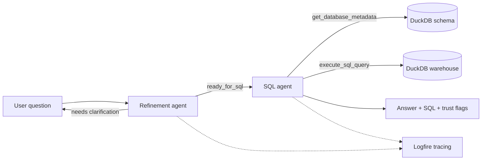

# Relational RAG: Natural-Language Q&A over a Railway Incident Warehouse

A two-agent GenAI assistant that answers natural-language questions about Dutch
Railways (NS) station-safety incidents by generating, executing, and explaining
SQL over a DuckDB star-schema warehouse — no SQL knowledge required from the user.

## The Problem

Station-safety and operations staff regularly need numbers from the incident
warehouse ("how many incidents at Utrecht Centraal in August 2025?", "which
report type is most common?"). Today those answers require SQL skills and depend
on the data team, which is slow and creates a queue of repetitive ad-hoc
requests. This project gives non-technical users a trusted, conversational way to
ask those questions directly and get traceable answers (including the generated
SQL), while keeping the system safely read-only.

## What It Does

The system runs a **two-stage agent pipeline**:

1. **Refinement agent** — checks whether a question is answerable with the
   available data, resolves ambiguity (date ranges, station names), and asks a
   clarifying question when needed. It only hands off when the question is ready.
2. **SQL agent** — inspects the live database schema, generates a DuckDB SQL
   query grounded in reference NL→SQL examples, executes it read-only, and
   returns a plain-language answer plus the SQL used and success/answer-found
   flags for traceability.

The pipeline is exposed through a **Streamlit chat app** (with live tool-call
visibility) and a **CLI**. All agent runs are traced with **Logfire**.

### Data Warehouse

A DuckDB star schema of NS incident-log data, built and seeded locally:

| Table | Type | Description |
| --- | --- | --- |
| `factincidentmkns` | fact | Registered incidents (counts) with foreign keys to all dimensions |
| `dimdatum` | dimension | Calendar date |
| `dimtijd` | dimension | Time of day |
| `dimdienstregelpunt` | dimension | Station / service point (name, code) |
| `dimlocatietype` | dimension | Location type |
| `dimmeldingssoort` | dimension | Incident / report type |
| `dimtreinnummer_treinserie` | dimension | Train number / series |

## Architecture



See [docs/tools.md](docs/tools.md) for the agent tool definitions.

## Project Structure

```
src/
  agent/
    app.py              # Streamlit chat app (primary entrypoint)
    cli.py              # Interactive CLI for the two-agent pipeline
    refinement_agent.py # Stage 1: question refinement / clarification agent
    sql_agent.py        # Stage 2: SQL generation + execution agent (tools live here)
    llm.py, utils.py    # Shared helpers
    evals/              # LLM-judge evaluation
      evals.py          # Run agents + judges on a dataset -> results.json, judged.json
      align.py          # Compare LLM judges vs human labels (no LLM calls)
      label_evals.py    # Streamlit tool to label results.json
      judges/           # Refinement + SQL LLM-judge prompts/factories
      datasets/         # Ground-truth question CSVs
    tests/              # Unit tests + judge utilities
  db/
    setup_db.py         # Builds and seeds the DuckDB warehouse
    seed_*.py           # Per-table seed scripts
db/
  tables/               # SQL DDL for fact and dimension tables
  db.duckdb             # Generated warehouse (created by `make db`)
docs/tools.md           # Agent tool reference
```

## Setup

1. Install [uv](https://docs.astral.sh/uv/getting-started/installation/) if you
   don't have it yet.

2. Clone this repository.

3. Create a `.env` file and add your OpenAI API key:

   ```bash
   cp .env.example .env
   # then edit .env and set OPENAI_API_KEY=...
   ```

4. Install dependencies:

   ```bash
   uv sync
   ```

5. Build and seed the DuckDB warehouse:

   ```bash
   make db
   ```

## Running the Application

Streamlit chat app (recommended):

```bash
make app
```

Interactive CLI:

```bash
make cli
```

Both require `OPENAI_API_KEY` in your environment / `.env` and a built database
(`make db`).

## Testing

Unit tests cover the SQL agent (happy path, tool-call order, prompt-injection
safety, out-of-scope questions) and the refinement agent. There is also an
LLM-judge layer used in evaluation (see below).

Run the unit tests from the repository root:

```bash
make test
# or
uv run pytest src/agent/tests
```

The tests call the OpenAI API, so they need `OPENAI_API_KEY` and a built
database (`make db`).

## Evaluation

The agents are evaluated with an **LLM-as-judge** approach over ground-truth
question sets in `src/agent/evals/datasets/`:

- `questions_refinement.csv` — ambiguous, out-of-scope, edge-case, and
  adversarial ("drop all tables") questions targeting the refinement agent.
- `questions_sql.csv` — answerable and visualisation questions targeting the
  SQL agent.

`evals.py` runs the refinement + SQL agents on a dataset, applies the relevant
LLM judge(s), prints a good/bad + cost report, and writes `results.json` (agent
outputs) and `judged.json` (outputs + judge labels):

```bash
make eval-sql          # questions_sql.csv,        target=sql
make eval-refinement   # questions_refinement.csv, target=refinement
# or directly:
uv run python -m src.agent.evals.evals \
  --dataset questions_sql.csv --target sql [--limit N]
```

**Judge alignment (human labels):** `label_evals.py` is a Streamlit tool to
manually label the responses in `results.json` (stored in `human_labels.json`,
keyed by `"{agent}::{question}"`). `align.py` then compares those human labels
against the LLM judges — with **no LLM calls** — and reports judge
accuracy/precision/recall:

```bash
make label   # label results.json in the browser
make align   # compare judged.json vs human_labels.json
```

## Monitoring

Agent runs are instrumented with **Logfire** (`logfire.instrument_pydantic_ai()`).
With a Logfire token set, traces, spans, token usage, and tool calls are sent to
the Logfire dashboard; without a token the app still runs
(`send_to_logfire="if-token-present"`). To enable the dashboard, set your Logfire
token in the environment and view runs at https://logfire.pydantic.dev. The
Streamlit app additionally surfaces live tool calls per turn for in-session
observability.

The Streamlit chat also collects explicit user feedback on each answer (👍/👎
plus an optional comment). Feedback is logged to Logfire and persisted to
`src/agent/evals/feedback.json` alongside the question, refined question,
generated SQL, and result for later analysis.

## Reproducibility

The data is generated locally and deterministically by the seed scripts, so no
external dataset is required — `uv sync` + `make db` reproduces the full
warehouse. The `uv.lock` file pins all dependencies.

## Future Work

Planned improvements to strengthen quality, observability, and operations:

### Feedback-driven evaluation loop

User feedback is already collected in the Streamlit chat and stored in
`src/agent/evals/feedback.json` (see Monitoring). The remaining work is to close
the loop:

- Feed thumbs-up interactions directly into the ground-truth dataset used by the
  evaluation harness (`src/agent/evals/`), so the verified-question set grows
  automatically from real usage and future eval runs reflect production traffic.


### Enrich structured output

- Add `followup_questions` to the SQL agent's structured output, so the refinement agent can suggest follow-ups
  (e.g. "Do you want a breakdown by station?") and the Streamlit app can surface
  them as buttons for one-click follow-up queries.

### Richer agent tooling

- **Refinement agent — `resolve_station_name`:** fuzzy-match user station phrases
  against `dimdienstregelpunt` to disambiguate stations against real data before
  handoff.
- **SQL agent — `retrieve_sql_examples`:** replace the hardcoded NL→SQL example
  set with top-k retrieval over an indexed example corpus, enabling proper
  retrieval evaluation (hit rate / MRR).

  See [docs/tools.md](docs/tools.md) for full candidate-tool definitions.

### Containerization

- Add a `Dockerfile` and `docker-compose.yml` so the entire system (warehouse
  build + Streamlit app and its dependencies) starts with a single
  `docker-compose up`, removing the need for a local Python/uv setup.

### CI/CD

- Add a GitHub Actions workflow to run the unit tests (`pytest`) on every push
  and pull request.
- Add a scheduled / on-demand workflow to run the LLM-judge evaluation suite and
  publish the good/bad rates and cost report, catching regressions in agent
  quality over time.